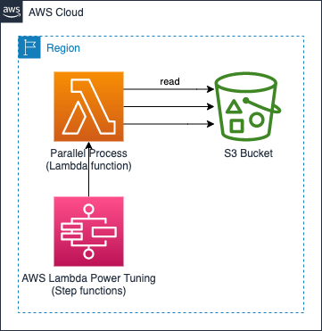

# Parallel dowload from Amazon S3 using Lambda function

Sample code to parallel read objects from Amazon S3 buckets which
showcases how to efficiently run I/O bound tasks using AWS Lambda
functions using Python.

For I/O bound tasks, you can use multiple threads. In this example
code, the concurrent.futures.ThreadPoolExecutor is used with a
maximum of 30 simultaneous threads, even though Lambda functions
support up to 1,024 threads (with one of those threads being your
main process). This limit is because too many threads create latency
issues due to context switching and utilization of computing
resources. You also need to increase the maximum pool connections in
botocore so that all threads can perform the S3 object download
simultaneously.

The example code uses one 8.3 KB object, with JSON data, in an S3
bucket. The object is read multiple times. After the Lambda function
reads the object, the JSON data is decoded to a Python object. In
December 2024, the result after running this example was 1,000 reads
processed in 2.3 seconds and 10,000 reads processed in 27 seconds
using a Lambda function configured with 2,304 MB of memory. AWS
Lambda supports memory configurations from 128MB to 10,240MB (10GB),
though increasing the Lambda memory beyond 2,304 MB didn't help to
decrease the time to run this particular I/O-bound task.

The code in this repository helps you set up the following target
architecture.

​

For prerequisites and instructions for using this AWS Prescriptive
Guidance pattern, see [Parallel reading from S3 in Lambda](https://apg-library.amazonaws.com/content/b46e9b16-9842-4291-adfa-3ef012b89aec). 

## Security

See [CONTRIBUTING](CONTRIBUTING.md#security-issue-notifications) for more information.

## License

This library is licensed under the MIT-0 License. See the LICENSE file.

